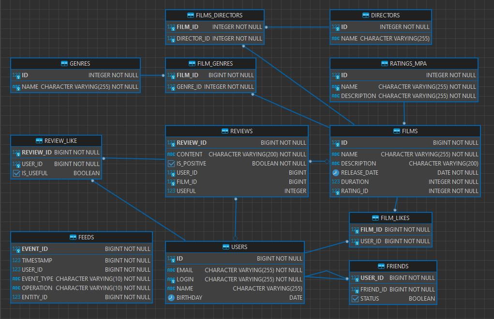

 

<h3 align="center">Filmorate</h3>
  

    yandex, filmorate
     
     
    <a href="https://github.com/alex-from-90/java-filmorate"><strong>Проект »</strong></a>
     
     
  

## О проекте

Этот проект - это платформа для любителей фильмов, которая предоставляет возможность пользователям выбирать,  и оценивать свои любимые фильмы, оставльть отзывы на них, выбирать  - полезный ли был отзыв или нет,а также находить наиболее популярные фильмы и отзывы. Так же есть возможность добавлять друзей,
удалять из друзей.
Реализован функционал просмотра общих друзей.

## Основан на: 

Java Amazon correctto 11 (11.0.19) 
Spring Boot 2.7 
Dependencies: 
Spring Web WEB 
Build web, including RESTful, 
applications using Spring MVC.  
Uses Apache Tomcat as the default embedded container. 

## Командная разработка
Алексей Ж. ( https://github.com/users/alex-from-90/ ) - Основа проекта, функциональность «Отзывы», team leader 

Дарина Ф. ( https://github.com/krakaduum/ ) - Функциональность «Фильмы по режиссёрам» 

Евгений Б. ( https://github.com/EvgeniyBushuev/ ) - Функциональность «Лента событий» 

Андрей Ц. ( https://github.com/DeepDarkFanta/ ) - Функциональность «Поиск» 

Никита М. ( https://github.com/nik110996/ ) - Функциональность «Рекомендации» 

Георгий П. ( https://github.com/ImING0/ ) - Функциональность «Удаление фильмов и пользователей», рефакторинг 

Евгений К. ( https://github.com/DayZscripter/ ) - Функциональность «Общие фильмы», «Популярные фильмы» 

**Особая благодарность:**  
Александр Н. ( https://github.com/AlNedorezov ) - Tech Lead 
Вячеслав Ш. ( https://github.com/slavrikk ) - Review

## Описание базы данных

Структура базы данных

**Таблица ratings_mpa:**

- id: уникальный идентификатор рейтинга (автоинкрементируемое целое число).
- name: название рейтинга (строка длиной до 255 символов).
- description: описание рейтинга (строка длиной до 255 символов).

**Таблица films:**

- id: уникальный идентификатор фильма (автоинкрементируемое целое число).
- name: название фильма (строка длиной до 255 символов).
- description: описание фильма (строка длиной до 200 символов).
- release_date: дата выпуска фильма.
- duration: продолжительность фильма (целое число).
- rating_id: идентификатор рейтинга фильма (ссылка на таблицу ratings_mpa).

**Таблица genres:**

- id: уникальный идентификатор жанра (автоинкрементируемое целое число).
- name: название жанра (строка длиной до 255 символов).

**Таблица film_genres:**

- film_id: идентификатор фильма (ссылка на таблицу films).
- genre_id: идентификатор жанра (ссылка на таблицу genres).
- Составной первичный ключ (film_id, genre_id).

**Таблица users:**

- id: уникальный идентификатор пользователя (автоинкрементируемое целое число).
- email: адрес электронной почты пользователя (строка длиной до 255 символов).
- login: логин пользователя (строка длиной до 255 символов).
- name: имя пользователя (строка длиной до 255 символов).
- birthday: дата рождения пользователя.

**Таблица film_likes:**

- film_id: идентификатор фильма (ссылка на таблицу films).
- user_id: идентификатор пользователя (ссылка на таблицу users).
- Составной первичный ключ (film_id, user_id).

**Таблица friends:**

- user_id: идентификатор пользователя (ссылка на таблицу users).
- friend_id: идентификатор друга пользователя (ссылка на таблицу users).
- status: статус дружбы (логическое значение).

**Таблица feeds:**

- event_id: уникальный идентификатор события.
- timestamp: временная метка события.
- user_id: идентификатор пользователя, связанного с событием.
- event_type: тип события (тип данных: varchar) с максимальной длиной 10 символов.
- operation: операция, связанная с событием , максимальной длиной 10 символов.
- entity_id: идентификатор сущности, связанной с событием.

**Таблица reviews:**

- review_id: уникальный идентификатор обзора (автоинкрементируемое целое число)
- content: содержание обзора с максимальной длиной 200 символов.
- is_positive: флаг, указывающий на то, является ли обзор положительным.
- user_id: идентификатор пользователя, связанного с обзором , который ссылается на столбец "id" в таблице "users".
- film_id: идентификатор фильма, связанного с обзором , который ссылается на столбец "id" в таблице "films".
- useful: число, указывающее на количество полезных голосов для обзора.

**Таблица review_like**

- review_id: идентификатор обзора, на который относится "лайк", который ссылается на столбец "review_id" в таблице "reviews".
- user_id: идентификатор пользователя, который оставил "лайк", который ссылается на столбец "id" в таблице "users".
- is_useful: флаг, указывающий, является ли "лайк" полезным (тип данных: boolean).
- Первичный ключ состоит из столбцов "review_id" и "user_id".

**Таблица DIRECTORS:** 

- ID: поле(автоинкрементируемое целое число), которое служит первичным ключом таблицы.
- NAME: строковое поле с максимальной длиной 255 символов, предназначенное для хранения имени режиссера.
- В данной таблице будут храниться данные о режиссерах. Каждая запись будет иметь уникальный идентификатор (ID), и будет содержать информацию о имени режиссера (NAME).

**Таблица FILMS_DIRECTORS:**

- film_id: целочисленное поле, которое является внешним ключом, ссылается на поле "id" в таблице "films" 
- director_id: целочисленное поле, которое является внешним ключом, ссылается на поле "id" в таблице "directors"

## Использование

Примеры запросов к базе данных:

 

Добавить фильм

    <pre>
   INSERT INTO film (film_id, title, description, duration, release_date)
VALUES (ID, 'TITLE', 'DESCRIPTION', DURATION , 'RELEASE (YYYY-MM-DD)';
</pre>

**Так же  нужно добавить жанр и рейтинг MPA**

<pre>
INSERT INTO film_genre (film_id, genre_id, mpa_rating_id)
VALUES (FILM_ID, GENRE_ID, MPA_RATING_ID);
    </pre>

Список жанров с id:
- **1** Комедия.
- **2** Драма.
- **3** Мультфильм.
- **4** Триллер.
- **5** Документальный.
- **6** Боевик.

Список рейтингов с id:
- **1** G — у фильма нет возрастных ограничений,
- **2** PG — детям рекомендуется смотреть фильм с родителями,
- **3** PG-13 — детям до 13 лет просмотр не желателен,
- **4** R — лицам до 17 лет просматривать фильм можно только в присутствии взрослого,
- **5** NC-17 — лицам до 18 лет просмотр запрещён.
   

   

Добавить Like фильму

    <pre>
    lINSERT INTO film_like (film_id, user_id)  VALUES (FILM_ID, 1);
    </pre>
   

   

Добавить в друзья

    <pre>
INSERT INTO friends (user_id, friend_id, status)  VALUES (USER_ID, FRIEND_ID, 'FALSE')
    </pre>

**Подтверждение дружбы**

<pre>
UPDATE friends
SET status = TRUE
WHERE user_id = ID_ПОЛЬЗОВАТЕЛЯ;
    </pre>

   

   

Добавление пользователя

    <pre>
   INSERT INTO "user" (user_id, email, login, name, birthdate)
VALUES (ID, 'USER_EMAIL', 'USER_LOGIN', 'USER_NAME', 'DATA OF BIRTHDAY YYYY-MM-DD');
    </pre>

**Пример обновления данных пользователя**

<pre>
UPDATE "user"
SET email = 'NEW_EMAIL'
WHERE user_id = ID;
</pre>
   

Добавление жанров фильмов в таблицу с жанрами

    <pre>
INSERT INTO genres (genre_id, genre_name) VALUES (4, 'Триллер');
INSERT INTO genres (genre_id, genre_name) VALUES (5, 'Документальный');
INSERT INTO genres (genre_id, genre_name) VALUES (6, 'Боевик');
  </pre>
 

Добавление рейтингов фильмов в таблицу с рейтингами

    <pre>
INSERT INTO mpa_rating (mpa_rating_id, mpa_name) VALUES (2, 'PG');
  </pre>
 

Получение MPA рейтинга фильма по id фильма

    <pre>
SELECT mpa.mpa_name
FROM film_genre fg
JOIN mpa_rating mpa ON fg.mpa_rating_id = mpa.mpa_rating_id
WHERE fg.film_id = FILM_ID;
  </pre>
 

Получение жанра фильма по id фильма

    <pre>
SELECT g.genre_name
FROM film_genre fg
JOIN genres g ON fg.genre_id = g.genre_id
WHERE fg.film_id = FILM_ID;
  </pre>
 

Показать друзей пользователя c ID 1

    <pre>
SELECT u.user_id, u.name, u.email
FROM friends f
JOIN "user" u ON f.friend_id = u.user_id
WHERE f.user_id = 1 AND f.status = true;
  </pre>
 

Получить 10 самых популярных фильмов (рейтинг основан на количестве лайков) 

    <pre>
SELECT f.film_id, f.title, COUNT(DISTINCT fl.user_id) AS like_count
FROM film f
LEFT JOIN film_like fl ON f.film_id = fl.film_id
GROUP BY f.film_id, f.title
ORDER BY like_count DESC
LIMIT 10;
  </pre>
 

